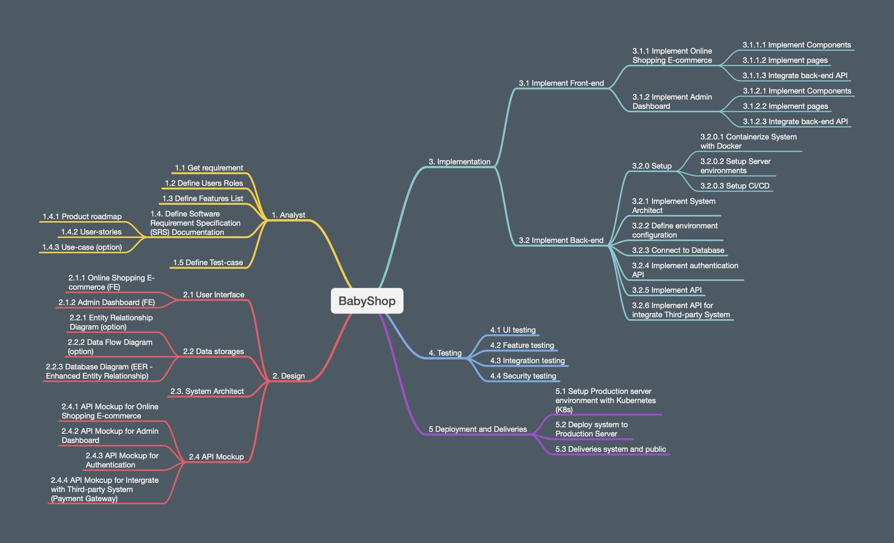

# Phase 01 - Get Requirement 

## 1 - Purpose

- Define requirement of project.
- Define goal of project.
- Define software process.

## 2 - List of Phases

Team will use Scrum process for this project's development.
The project's 

## 3 - Define requirement

We want to develop a E-commerce system for selling toys for babies such as cars, tedddy bear,... The system have these functions:

* List of items in the system.
* Show detail information of items.
* User can register their information to get membership program.
* User can choose and buy items.
* User can search for specific items.
* Admin can manage items' information.
* Admin can manage users' orders.
* Admin can manage users' information.
* Admin can manage membership's information such as create and manage vouchers.
* Admin can create reports for selling and information of items.

That's all for the basic requirements.

After that, the teeam can brainstorm to define advanced requirements such as connect to payment gateway, notify to admin when user created an order,...

## 4 - Create project plan

* Create Project Plan Document
* Setup Resources
    * Human Resources
    * Financial Resources
    * Device Resources
    * Tools Resources: Jira, Github, Server,...
* Define goal of Project
* Planning for Project
    * Get requirement
    * Analyze requirement
* Setup
    * Storage Design
    * UI Design
    * System Design
        * Architecture system Design
        * API Hookup Design
        * Dataasae Schema Design

Using template from [https://sceweb.sce.uhcl.edu/helm/RUP_Folder/RationalUnifiedProcess/process/templates.htm](https://sceweb.sce.uhcl.edu/helm/RUP_Folder/RationalUnifiedProcess/process/templates.htm)