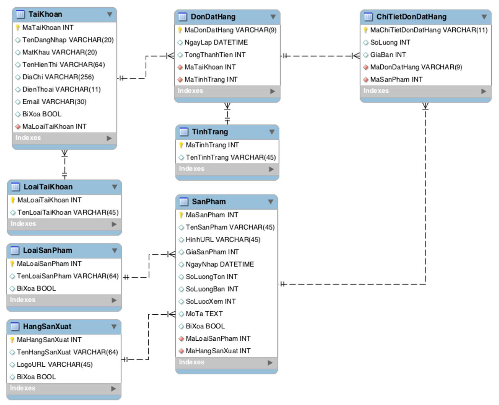

# Database Design

## 1 - Database Diagram

## 2 - Database Specification

### 2.1 - List of Tables.

| No     | Table Name     | Description                          |
| :----: | :------------: | :----------------------------------: |
| 1      | loaitaikhoan   | Thông tin phân quyền của tài khoản   |
| 2      | taikhoan       | Thông tin tài khoản                  |
| 3      | hangsanxuat    | Thông tin hãng sản xuất              |
| 4      | loaisanpham    | Thông tin danh mục sản phẩm          |
| 5      | sanpham        | Thông tin sản phẩm                   |
| 6      | tinhtrang      | Thông tin tình trạng của đơn đặt     |
| 7      | dondathang     | Thông tin chi tiết đơn đặt hàng      |

### 2.1 - Tables structure.

2.2.1 - Table: ***loaitaikhoan***

| No     | Field Name          | Data type      | Key (PK/FK) | Description                          |
| :----: | :------------:      | :------------: | :---------: | :----------------------------------: |
| 1      | maloaitaikhoan      | int            | PK          | mã loại tài khoản                    |
| 2      | tenloaitaikhoan     | varchar(45)    |             | tên của tài khoản                    |

2.2.2 - Table: ***taikhoan***
2.2.3 - Table: ***hangsanxuat***
2.2.4 - Table: ***loaisanpham***
2.2.5 - Table: ***sanpham***
2.2.6 - Table: ***tinhtrang***
2.2.7 - Table: ***dondathang***
2.2.8 - Table: ***chitietdondathang***