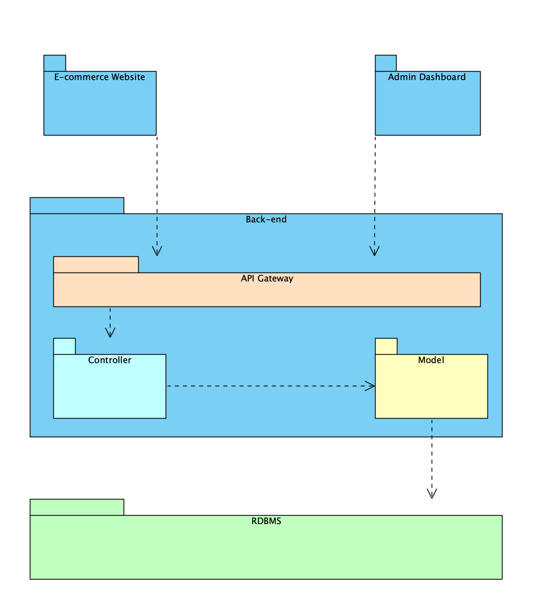

# Software Architecture Design

## 1 - Architecture Diagram

## 2 - Architecture Description

* ***E-Commerce Website*** - is the frontend for customers can buy the product. It is built with ReactJS.

* ***Admin Dashboard*** - is the frontend for the Admin and Employee to manage systems. It is built with ReactJS.

* ***Backend*** - is the backend systems to access databases and manage business logic for the system.

* ***API Gateway*** - is for manage the request of the frontend and direct to ***Controller*** which process the process.

* ***Controller*** - is for process the logic of the business.
* ***model*** - is for manage the object which is loaded and access data from database.
* ***RDBMS*** - is the relational database managing stystem.