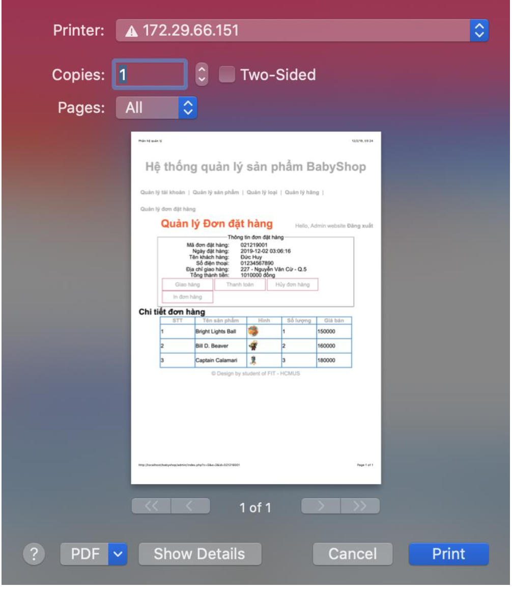

# User Interface Design

## 1 - E-Commerce Website

### 1.1 - Sitemap

### 1.2 - List of UI

***ui-em-01*** homepage

***ui-em-02*** List of products by brands

***ui-em-03*** List of products by categories

***ui-em-04*** Product detail-un-sign-in

***ui-em-05*** Product detail-sign-in

***ui-em-06*** Shopping cart

***ui-em-07*** Error Display

## 2 - Admin Dashboard

### 2.1 - Sitemap

### 2.2 - List of UI:

* ***ui-ad-01*** Homepage

* ***ui-ad-02*** List of account

* ***ui-ad-03*** Update Account

* ***ui-ad-04*** List of cateogories

* ***ui-ad-05*** Add new category

* ***ui-ad-06*** Update Cateogory

* ***ui-ad-07*** List of brands

* ***ui-ad-08*** Add a new brand

* ***ui-ad-09*** Update Brand

* ***ui-ad-10*** List of products

* ***ui-ad-11*** Add new product

* ***ui-ad-12*** Update Product

* ***ui-ad-13*** List of Orders

* ***ui-ad-14*** Order Detail

* ***ui-ad-15*** Print Of Payment

* ***ui-ad-16*** PDF of Payment

